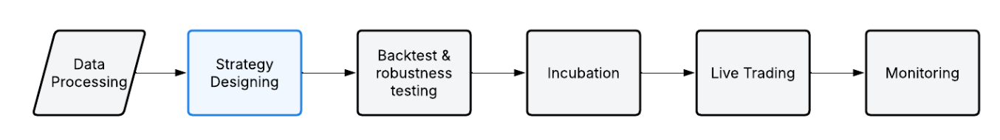
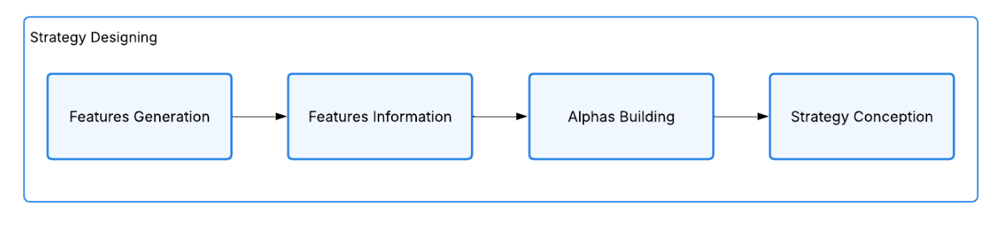

# AI Trading Lab  
A scientific framework for building robust systematic strategies powered by AI.  
Program link: https://www.quantreo.com/ai-trading-lab/

---

## Overview

AI Trading Lab focuses only on one thing. The generation of high quality strategies from data.  
We do not cover the entire trading pipeline in detail. The objective here is to master the core block that decides whether a strategy is solid or not.

You learn how to generate features, evaluate their information, build alphas and assemble complete strategies with a clear and scientific process.  
This helps you reduce overfitting, limit multiple hypothesis testing and design signals that survive out of sample.

Below are the two diagrams that guide the workflow.

